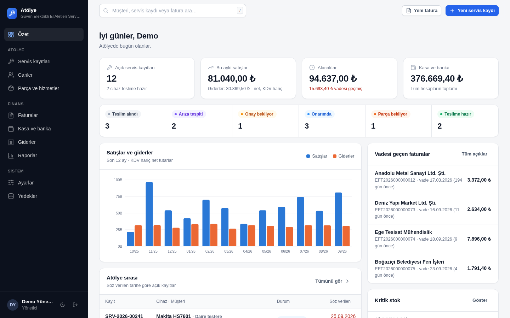
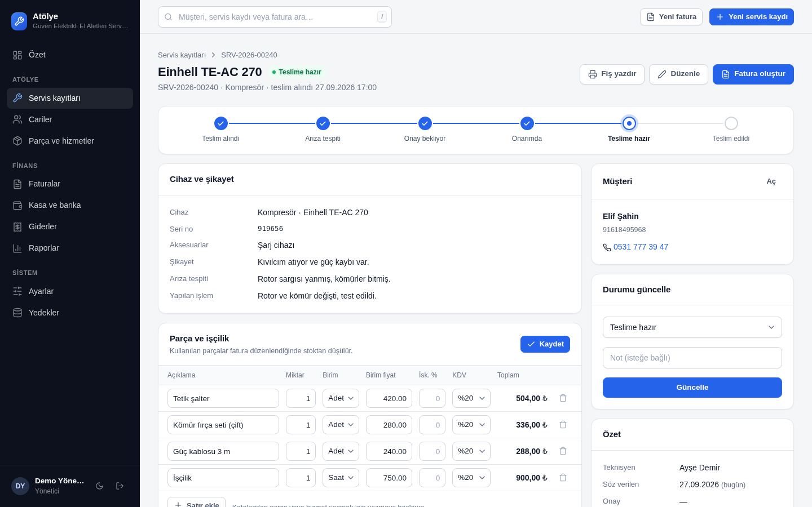
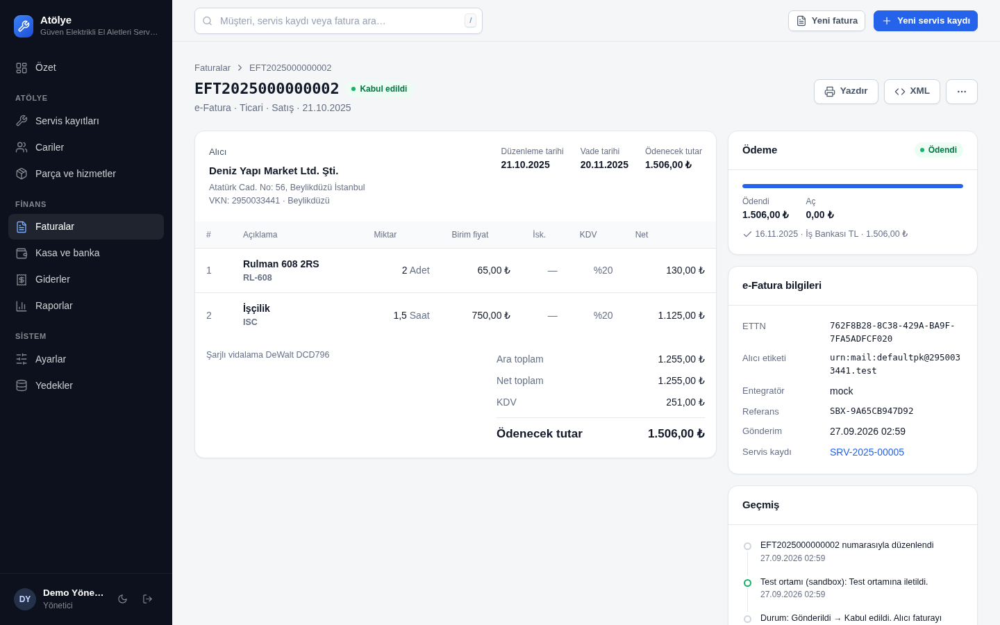
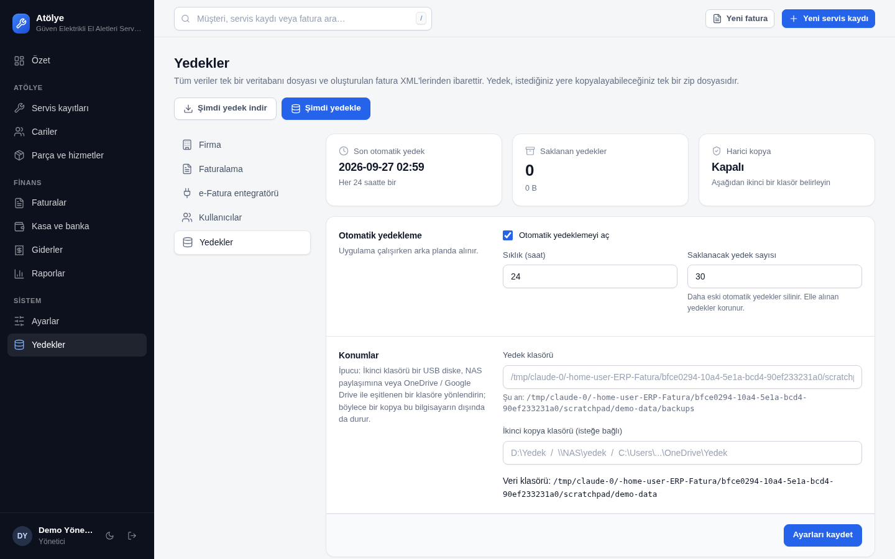

# Atölye — repair shop management, e-Fatura & bookkeeping

A self-hosted web application for a medium-sized **power-tool repair workshop** in Türkiye:

- **Service orders** (servis kayıtları): intake → diagnosis → customer approval → repair → pickup, with a printable
  intake/delivery receipt, technician assignment, parts & labour, and an activity log.
- **Customers & suppliers** (cari hesaplar): VKN/TCKN validation, one-click GİB e-Fatura registration check, account
  statements (ekstre) with running balance.
- **e-Fatura / e-Arşiv**: generates **UBL-TR 1.2** XML (TEMELFATURA, TICARIFATURA, EARSIVFATURA; SATIŞ, İADE,
  TEVKİFAT, İSTİSNA), GİB-format numbering (`EFT2026000000001`), and sends it through the integrator of your choice
  (EDM, İzibiz, Logo, Nilvera, QNB eFinans, Sovos, Uyumsoft, or manual XML upload), adapting the XML to each one.
- **Bookkeeping** (ön muhasebe): cash/bank/POS accounts, collections and payments, transfers, expenses with deductible
  VAT, monthly profit & VAT report, CSV exports for the accountant (mali müşavir).
- **Parts & stock**: parts catalogue with stock that is deducted automatically when an invoice is issued, low-stock
  warnings.
- **Backups**: everything is one folder. One-click and automatic backups to a zip file, a second copy to a
  USB/NAS/OneDrive folder, and a one-step restore.
- Turkish UI (English available per user), light & dark theme, works on phones and tablets in the workshop.

| Dashboard | Service order |
|---|---|
|  |  |
| **Invoice** | **Backups** |
|  |  |

Dark mode and mobile: [dashboard-dark.png](docs/screenshots/dashboard-dark.png), [mobile.png](docs/screenshots/mobile.png)

---

## Quick start

Requires **Python 3.10+**. No database server — data is a single SQLite file.

**Windows (typical workshop PC):** double-click `start-windows.bat`. The first run installs everything into `.venv`.

**Linux / macOS:**

```sh
./start.sh                     # or: pip install -r requirements.txt && python run.py
```

Open <http://localhost:8080>. On first launch a setup page creates the administrator account. Other computers,
tablets and phones on the same network use the address printed in the console, e.g. `http://192.168.1.20:8080`.

**Docker:**

```sh
docker compose up -d           # data is kept in ./data
```

**Try it with demo data** (a fictional workshop, ~230 invoices, 12 open repair jobs):

```sh
flask --app app seed-demo      # then log in with  demo / demo1234
```

## Where the data lives — and backing it up

Everything the application stores is in **one folder** (`data/` next to the app, or `ERP_DATA_DIR`):

```
data/
  erp.db            # the database (customers, orders, invoices, bookkeeping, settings)
  files/invoices/   # the UBL-TR XML of every issued invoice
  secret.key        # session signing key
  backups/          # automatic and manual backups (default location)
```

**Settings → Backups** gives you:

- **Automatic backups** every N hours while the app runs (default: daily, keep the last 30).
- **Second copy folder**: point it at a USB disk, a NAS share or a OneDrive / Google Drive synced folder so a copy
  always leaves the PC. *Recommended.*
- **Back up now / Download backup now**: one zip file containing a consistent database snapshot (taken with SQLite's
  online backup API, safe while people are working), all invoice XML files and a manifest with a checksum.
- **Restore**: from the list or by uploading a zip. The archive is validated (checksum + SQLite integrity check) and a
  *pre-restore* safety backup is taken first, so a restore can itself be undone.

From the command line: `flask --app app backup [--dest D:\Yedek]`, `flask --app app restore file.zip`,
`flask --app app info`.

**Moving to a new computer:** install the app there, then Settings → Backups → *Restore from a file*.

## e-Fatura integration

Turkish e-invoices must be delivered to GİB through a licensed **special integrator** (özel entegratör). This app
creates the invoice XML; the integrator signs it with the company's seal (mali mühür) and delivers it. Pick the
integrator in **Settings → e-Invoice integrator**:

| Integrator | Transport | e-Fatura | e-Arşiv | GİB lookup | Status | e-Arşiv cancel |
|---|---|:-:|:-:|:-:|:-:|:-:|
| **Sandbox** (default) | none — simulated, for training | ✓ | ✓ | ✓ | ✓ | ✓ |
| **Manual XML export** | writes XML to a folder, upload in any integrator's portal | ✓ | ✓ | – | manual | ✓ |
| **EDM Bilişim** | SOAP `EFaturaEDM.svc`, session login | ✓ | ✓ | ✓ | ✓ | – |
| **İzibiz** | SOAP `AuthenticationWS` / `EInvoiceWS` / `EIArchiveWS` | ✓ | ✓ | ✓ | ✓ | ✓ |
| **Logo eLogo** | SOAP `PostBoxService`, session login, zipped UBL | ✓ | ✓ | ✓ | ✓ | – |
| **Nilvera** | REST, API key | ✓ | ✓ | ✓ | ✓ | ✓ |
| **QNB eSolutions (eFinans)** | SOAP `connectorService` + `EarsivWebService`, WS-Security | ✓ | ✓ | ✓ | ✓ | ✓ |
| **Sovos (Foriba)** | SOAP `ClientEInvoiceServices` (`sendUBL`), HTTP Basic | ✓ | – | – | ✓ | – |
| **Uyumsoft** | SOAP `Services/Integration`, WS-Security | ✓ | ✓ | ✓ | ✓ | ✓ |

A "–" means the adapter does not implement it yet; the app says so clearly (and e.g. suggests manual export for
Sovos e-Arşiv invoices) instead of failing silently. Other integrators (Turkcell e-Şirket, Mysoft, Digital Planet,
Veriban, Kolaysoft…) work today through **Manual XML export**; a direct adapter is one small file (see below).

### How the XML is adapted per integrator

Every integrator accepts UBL-TR, but they differ in details. The app therefore keeps two files per invoice:

1. **Canonical XML** — built once when the invoice is issued. This is the business record and never changes.
2. **Sent XML** — produced right before sending by applying the chosen integrator's *XML profile*, and stored
   exactly as sent (`data/files/invoices/<number>_<uuid>.<integrator>.xml`). The invoice's *XML* button downloads it.

The profile covers the differences that matter in practice, each preset per integrator and overridable in
Settings under *XML adjustments*:

| Option | Why it differs |
|---|---|
| Embed invoice display template (XSLT) | GİB, portals and the receiver show the invoice through an XSLT embedded in the XML. The app ships its own template (`app/services/xslt/invoice.xslt`); integrators that apply their own design can skip it. |
| e-Arşiv delivery type in the XML | Some integrators read the e-Arşiv *gönderim şekli* from the XML (`AdditionalDocumentReference` / `SendingType`), others from API fields (Uyumsoft `EArchiveInvoiceInfo`, İzibiz `EARSIV_PROPERTIES`). |
| ETTN upper case | Case of the invoice UUID. |
| Indented XML | Some parsers dislike whitespace between elements. |

Adapters can also change the XML tree in code (`customize_xml`) and choose the packaging (raw, base64,
zipped + MD5 hash, or embedded in the SOAP body), which each adapter does according to its API.
*As the recipient sees it* on an invoice renders the sent XML with its embedded template.

### Before going live — please read

The adapters were written from the integrators' published method names and common usage, **not tested against their
live test services** (this development environment could not reach them). They are marked **Unverified** in the
settings. Their request building and response parsing are covered by tests with a simulated server, but real
services may name a field or namespace differently. For the integrator the shop uses:

1. Get a **test account** from the integrator (Uyumsoft publishes one: `Uyumsoft` / `Uyumsoft`).
2. In Settings choose the integrator, environment *Test*, enter the credentials, tick *Log requests and responses*,
   and press **Save & test connection**.
3. Check a customer's e-Fatura status and send a few test invoices (e-Fatura and e-Arşiv).
4. If something fails, `data/logs/integrator-YYYY-MM.log` contains every request and response (passwords removed).
   The fix is usually a one-line change in `app/services/integrators/<integrator>.py`; service addresses can be
   changed in Settings without code.
5. Switch to *Production*, turn logging off, and set the invoice series and starting number (Settings → Invoicing).

### Adding an integrator

Subclass `Integrator` in `app/services/integrators/` and register it in `integrators/__init__.py`:

```python
class MyIntegrator(Integrator):
    key, label = "mine", "My Integrator"
    capabilities = {"efatura", "earsiv", "lookup", "status"}
    xml_defaults = XmlOptions(embed_xslt=True, earsiv_sending_type=False)
    URLS = {"test": {"default": "https://…"}, "production": {"default": "https://…"}}
    fields = [ENV_FIELD, ConfigField("username", "Username"), ConfigField("password", "Password", kind="password"),
              DEBUG_FIELD]

    def check_user(self, tax_id): ...          # -> [Alias(...)]
    def send(self, invoice, xml, receiver_alias=""): ...   # -> SendResult
    def get_status(self, invoice): ...         # -> StatusResult
```

`soap.py` provides envelope / WS-Security / fault helpers; `self.soap_call(...)` handles transport and logging.
Settings and translations pick the new adapter up automatically (add its strings to `translations_tr.py`).

## Accounting scope

This is **pre-accounting (ön muhasebe)**: it tracks sales, purchases, receivables, payables, cash and bank, and
estimates monthly KDV (hesaplanan − tevkif edilen − indirilecek). The official books, e-Defter and tax returns remain
with the accountant — the *Reports → For your accountant* menu exports invoices, invoice lines, expenses,
cash/bank movements and contact balances as Excel-friendly CSV (UTF-8 with BOM, `;` separated, decimal comma).

## Everyday flow in the workshop

1. **Customer drops off a tool** → *New service order* → pick/create the customer, record device, serial number,
   accessories and complaint → *Save & print receipt* (customer signs the intake receipt).
2. **Technician** diagnoses, adds parts & labour (from the catalogue), sets status *Awaiting approval* → customer
   approves → *In repair* → *Ready for pickup*.
3. **Create invoice** from the order → the app picks e-Fatura or e-Arşiv from the customer's GİB registration and
   applies 7/10 KDV tevkifat (code 603, repair services) for designated buyers → *Issue & send*.
4. **Record the payment** on the invoice (cash, bank, POS). Unpaid invoices show up as receivables and overdue alerts.
5. Enter **expenses** (rent, parts purchases…) as they come in. At month end, check **Reports** and send the CSV
   exports to the accountant.

## Development

```sh
pip install -r requirements-dev.txt
pytest                          # unit + end-to-end tests
python scripts/i18n_check.py    # lists UI strings missing a Turkish translation
flask --app app run --debug     # dev server with auto reload
```

```
app/
  models.py                 # SQLAlchemy models (money stored as exact integer kuruş)
  services/calc.py          # invoice arithmetic (Decimal, half-up rounding)
  services/ubl.py           # UBL-TR XML builder + business validation
  services/invoicing.py     # draft → issued → sent/accepted lifecycle, numbering, stock
  services/integrators/     # integrator adapters + SOAP helpers
  services/ubl_profile.py   # per-integrator XML adaptation, XSLT embedding and rendering
  services/backup.py        # backup / restore / scheduler
  routes/                   # Flask blueprints
  templates/, static/       # server-rendered UI, no build step, no CDN (works offline)
  translations_tr.py        # Turkish UI strings
```

UI strings are written in English in the code and translated through `app/translations_tr.py`; the test suite fails
if a string has no Turkish translation.
